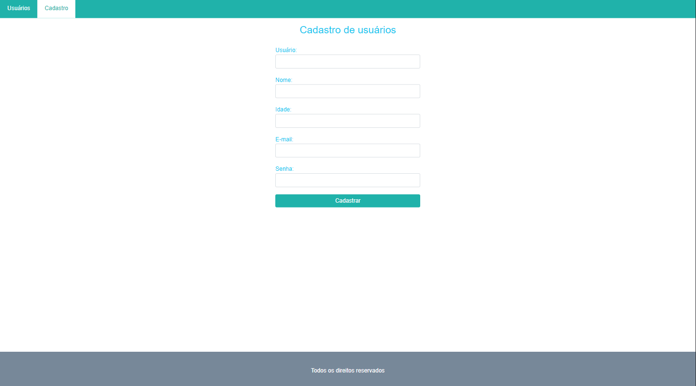
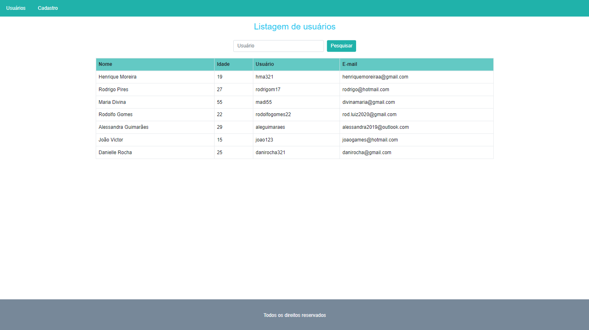

# Users

### SOBRE O PROGRAMA
Esse codigo é de um Sistema Web com o Front End feito em React Js e o Back End feito em Spring Boot

### DEPLOY LOCAL
* Utilize o Spring Tols Suide para Rodar o Back-End, basta abrir em sua workspace e rodar o programa;
* Para rodar o front end, basta clonar a pasta do front end e abrir a pasta no vscode, abrir o terminal entrar na pasta e utilizar o comando "npm start";

### TECNOLOGIAS UTILIZADAS
* 
* 
* 
* 
* 
* 

### Imagens do Sistema Web

----------------------------
#### SE VOCÊ CHEGOU ATÉ AQUI
Muito obrigado pela atenção

#### SOBRE O AUTOR/ORGANIZADOR
Henrique Moreira Amorim henriquemoreiraa@gmail.com
